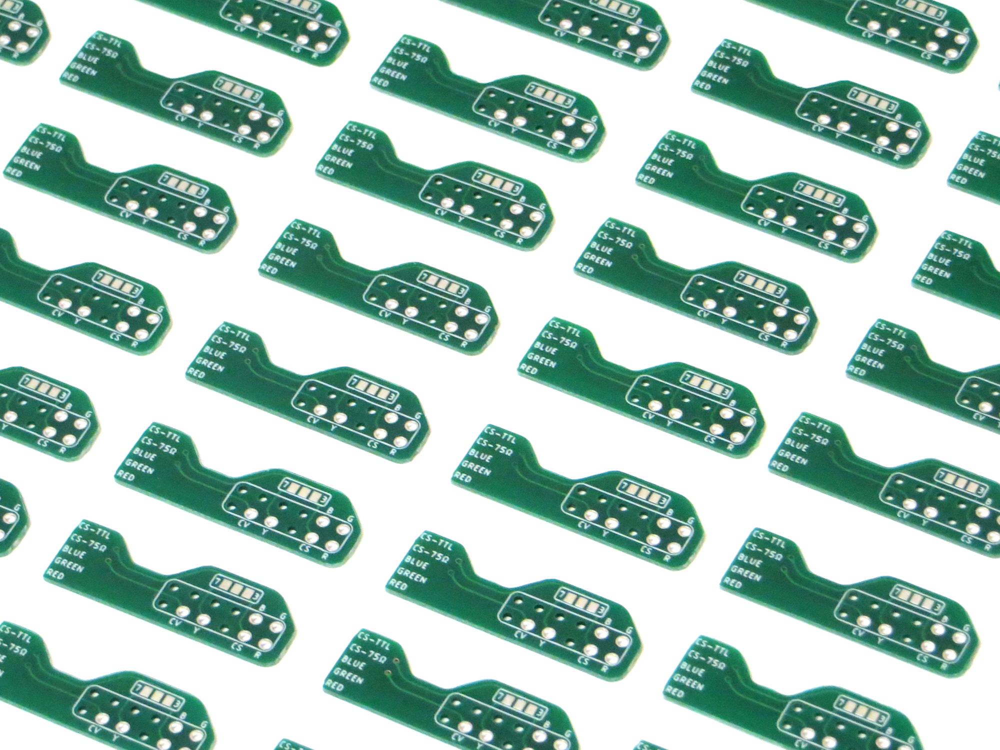

# Nintendo 64 AV Multiout Breakout PCB

A simple little PCB to help when RGB modding an N64. Add this little PCB to the multiout’s PCB pins and solder wires to this PCB instead of directly to the pins. Much neater. There's a jumper to rout the sync to different output pins.

## Version History

- v1 - 30/07/2021
